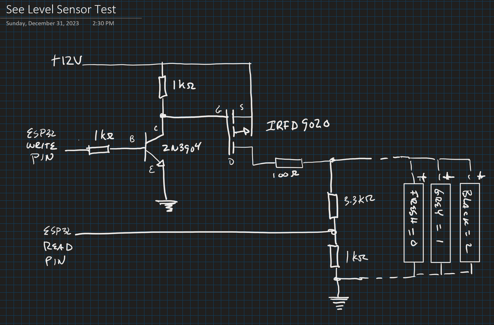

## 3.3V <-> 12V SeeLevel Interface

To interface, I built a level-shifter using this forum post as a guide:

https://forums.raspberrypi.com/viewtopic.php?t=119614

Based on available components, and to make sure that the read pin sees no more than 3.3v, resistor values for voltage divider on read pin were changed to 10k & 3k.

